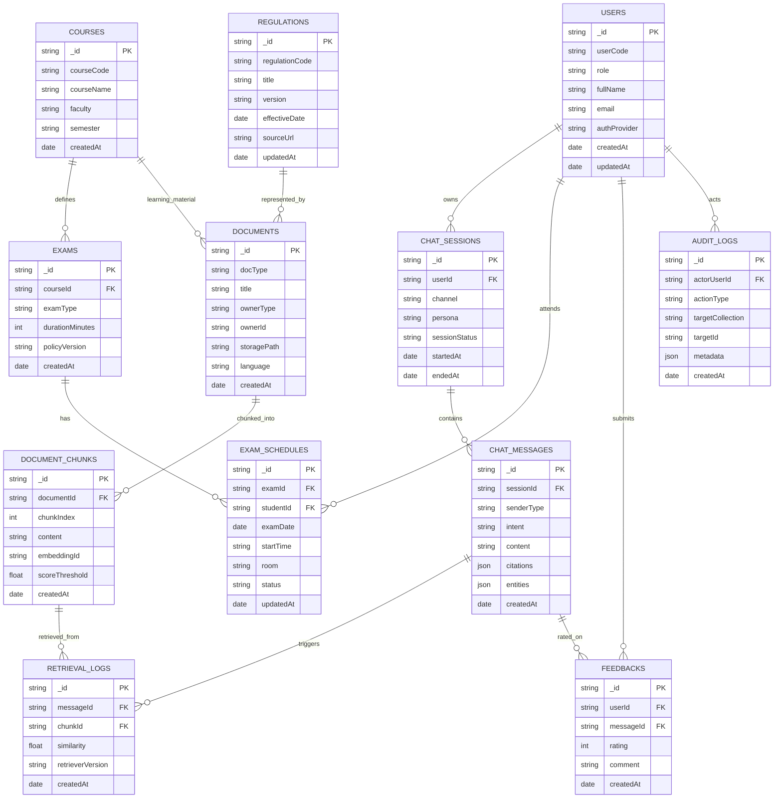

# GC-Proctor NoSQL ERD

## Mục tiêu thiết kế
- Tối ưu cho chatbot truy vấn nhanh, lưu hội thoại theo phiên, và hỗ trợ RAG.
- Kết hợp quan hệ tham chiếu (reference) và dữ liệu nhúng (embedded) theo từng nghiệp vụ.
- Ưu tiên mở rộng ngang và truy vấn theo user, môn học, kỳ thi, và nguồn tài liệu.

## ERD theo hướng NoSQL (Collection-centric)

## Quyết định mô hình dữ liệu NoSQL
- `USERS`: thông tin danh tính chuẩn hóa; profile mở rộng có thể nhúng vào field `profile` nếu cần.
- `CHAT_SESSIONS` + `CHAT_MESSAGES`: tách riêng để tránh document vượt 16MB và để phân trang lịch sử chat.
- `DOCUMENTS` + `DOCUMENT_CHUNKS`: tối ưu RAG, cho phép re-index theo từng document.
- `EXAM_SCHEDULES`: lưu bản sao lịch thi theo sinh viên để tra cứu nhanh theo `studentId`.
- `RETRIEVAL_LOGS`: theo dõi chunk nào được gọi, phục vụ đánh giá accuracy và fallback.

## Đề xuất index chính
- `USERS`: unique(`userCode`), unique(`email`).
- `COURSES`: unique(`courseCode`, `semester`).
- `EXAM_SCHEDULES`: index(`studentId`, `examDate`), index(`examId`).
- `DOCUMENT_CHUNKS`: index(`documentId`, `chunkIndex`), index(`embeddingId`).
- `CHAT_MESSAGES`: index(`sessionId`, `createdAt`), index(`intent`).
- `RETRIEVAL_LOGS`: index(`messageId`), index(`chunkId`, `similarity`).
- `FEEDBACKS`: index(`messageId`), index(`userId`, `createdAt`).

## Embedded vs Reference
- Nên embedded:
  - `CHAT_MESSAGES.entities` và `CHAT_MESSAGES.citations` (nhỏ, đi cùng message).
  - metadata nhỏ của document trong `DOCUMENTS`.
- Nên reference:
  - `CHAT_SESSIONS` -> `CHAT_MESSAGES`.
  - `DOCUMENTS` -> `DOCUMENT_CHUNKS`.
  - `EXAMS` -> `EXAM_SCHEDULES`.

## Lưu ý mở rộng
- Có thể tách thêm collection `MODEL_CONFIGS` để quản lý prompt, retriever, fallback policy theo version.
- Có thể bổ sung `TENANTS` nếu sau này cần hỗ trợ đa trường/đa đơn vị.
