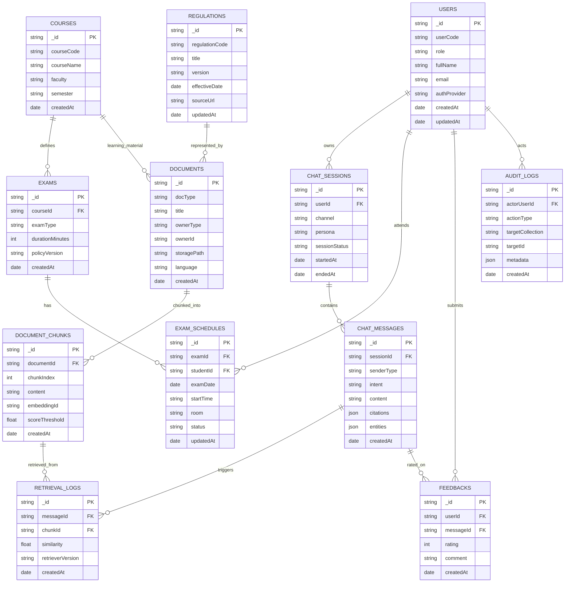

# GC-Proctor NoSQL ERD

## Muc tieu thiet ke
- Toi uu cho chatbot truy van nhanh, luu hoi thoai theo phien, va ho tro RAG.
- Ket hop quan he tham chieu (reference) va du lieu nhung (embedded) theo tung nghiep vu.
- Uu tien mo rong ngang va truy van theo user, mon hoc, ky thi, va nguon tai lieu.

## ERD theo huong NoSQL (Collection-centric)

## Quyet dinh mo hinh du lieu NoSQL
- `USERS`: thong tin danh tinh chuan hoa; profile mo rong co the nhung vao field `profile` neu can.
- `CHAT_SESSIONS` + `CHAT_MESSAGES`: tach rieng de tranh document vuot 16MB va de phan trang lich su chat.
- `DOCUMENTS` + `DOCUMENT_CHUNKS`: toi uu RAG, cho phep re-index theo tung document.
- `EXAM_SCHEDULES`: luu ban sao lich thi theo sinh vien de tra cuu nhanh theo `studentId`.
- `RETRIEVAL_LOGS`: theo doi chunk nao duoc goi, phuc vu danh gia accuracy va fallback.

## De xuat index chinh
- `USERS`: unique(`userCode`), unique(`email`).
- `COURSES`: unique(`courseCode`, `semester`).
- `EXAM_SCHEDULES`: index(`studentId`, `examDate`), index(`examId`).
- `DOCUMENT_CHUNKS`: index(`documentId`, `chunkIndex`), index(`embeddingId`).
- `CHAT_MESSAGES`: index(`sessionId`, `createdAt`), index(`intent`).
- `RETRIEVAL_LOGS`: index(`messageId`), index(`chunkId`, `similarity`).
- `FEEDBACKS`: index(`messageId`), index(`userId`, `createdAt`).

## Embedded vs Reference
- Nen embedded:
  - `CHAT_MESSAGES.entities` va `CHAT_MESSAGES.citations` (nho, di cung message).
  - metadata nho cua document trong `DOCUMENTS`.
- Nen reference:
  - `CHAT_SESSIONS` -> `CHAT_MESSAGES`.
  - `DOCUMENTS` -> `DOCUMENT_CHUNKS`.
  - `EXAMS` -> `EXAM_SCHEDULES`.

## Luu y mo rong
- Co the tach them collection `MODEL_CONFIGS` de quan ly prompt, retriever, fallback policy theo version.
- Co the bo sung `TENANTS` neu sau nay can ho tro da truong/da don vi.
