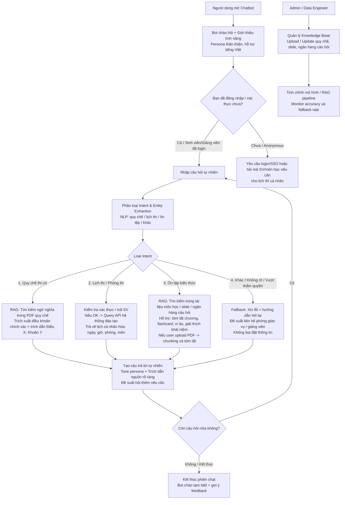

# GC-Proctor

## Sơ đồ Userflow tổng quát (Main Conversation Flow)

### Giải thích chi tiết các luồng chính

1. **Luồng chung (Onboarding & Conversation Loop)**
- Người dùng bắt đầu chat → Bot chào hỏi, giới thiệu khả năng (tra quy chế, lịch thi, ôn tập).
- Hỗ trợ anonymous cho quy chế và ôn tập chung; yêu cầu login/mã SV cho lịch thi cá nhân.
- Luôn loop lại để hỏi tiếp hoặc kết thúc.

2. **Luồng tra cứu Quy chế thi (Không cần login)**
- Câu hỏi ví dụ: "Đem điện thoại vào phòng thi có bị gì không?"
- Bot → Intent classification → RAG search → Trả lời chính xác 100% + trích dẫn điều khoản.

3. **Luồng tra cứu Lịch thi (Cá nhân hóa, cần xác thực)**
- Câu hỏi ví dụ: "Mai thi môn Nhập môn Kỹ thuật Phần mềm lúc mấy giờ, phòng nào?"
- Bot → Kiểm tra login/mã SV → Query API → Trả lịch cụ thể.

4. **Luồng Ôn tập kiến thức (Tutor mode)**
- Câu hỏi ví dụ: "Giải thích khái niệm Dependency Injection" hoặc "Tóm tắt chương 5 môn Cơ sở dữ liệu".
- Bot → RAG trên tài liệu môn học → Có thể generate flashcard, tóm tắt, ví dụ.
Hỗ trợ upload file PDF bài giảng để tóm tắt nhanh.

5. **Luồng Admin / Quản lý (riêng biệt, không nằm trong chat user)**
- Admin truy cập dashboard → Upload/update tài liệu → Chunking & embedding → Tinh chỉnh RAG.

### Lưu ý khi triển khai Userflow
- **Fallback handling:** Rất quan trọng để đảm bảo accuracy 100% cho quy chế & lịch thi (không hallucinate).
- **Persona:** Bot nên có giọng điệu thân thiện, hỗ trợ, đôi khi khuyến khích học tập (ví dụ: "Cố lên nhé, sắp thi rồi đó!").
- **Tích hợp:** Login/SSO → API hệ thống đào tạo → RAG pipeline (vector DB như Pinecone/Chroma).
- **Edge cases:** Hỏi vượt thẩm quyền (điểm số cá nhân, thông tin nhạy cảm) → redirect đến giáo vụ.